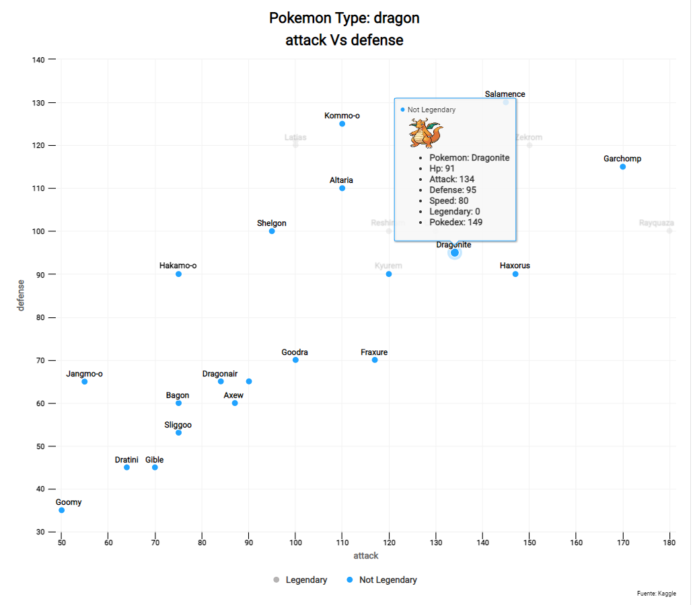
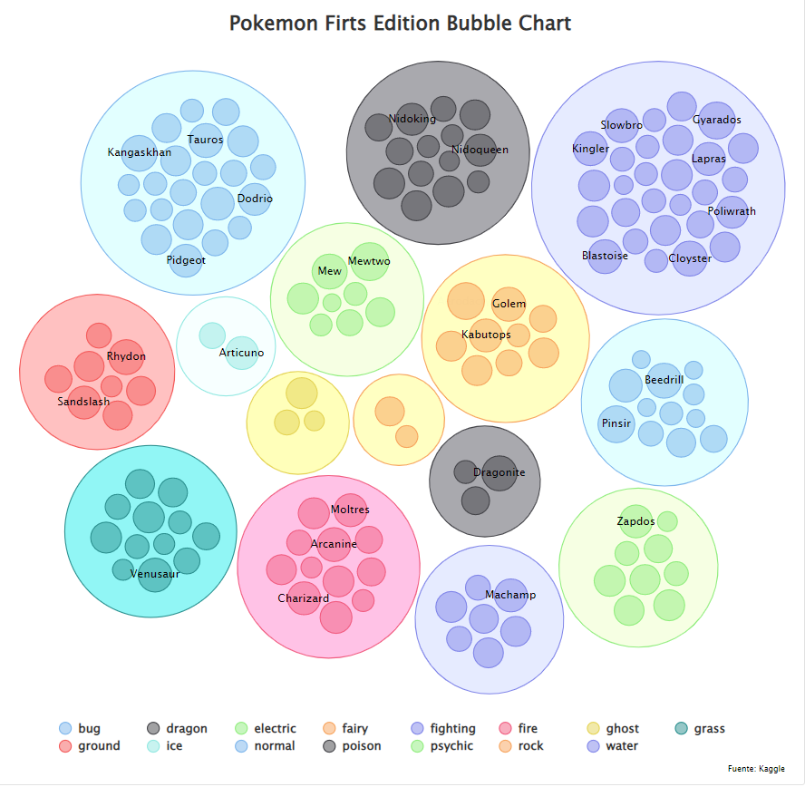
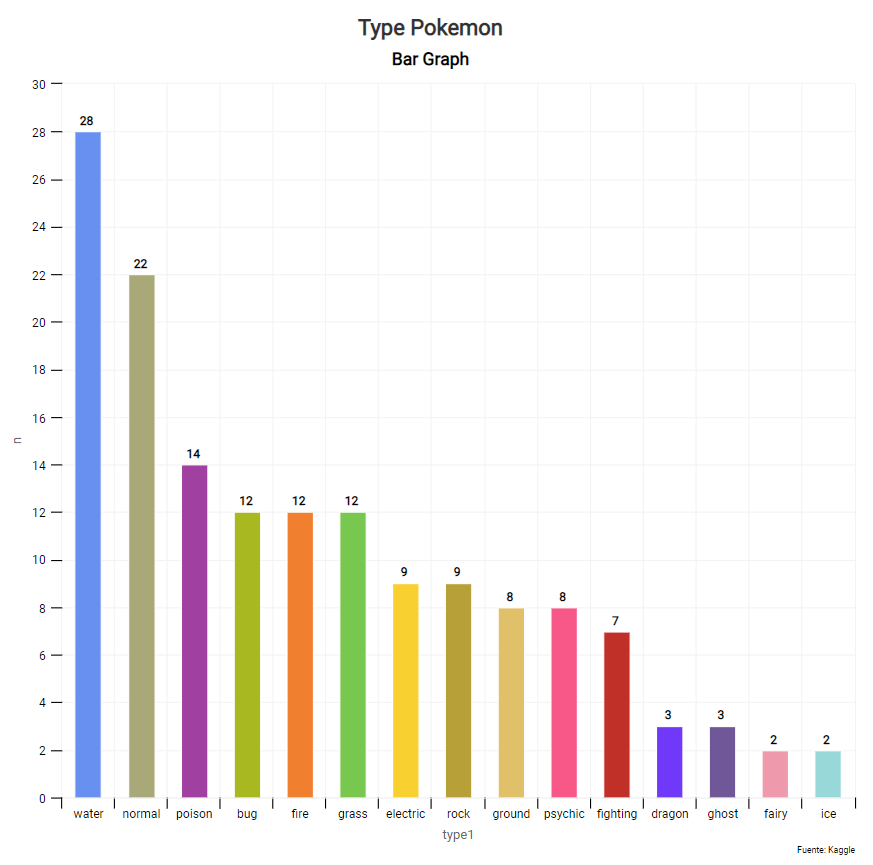
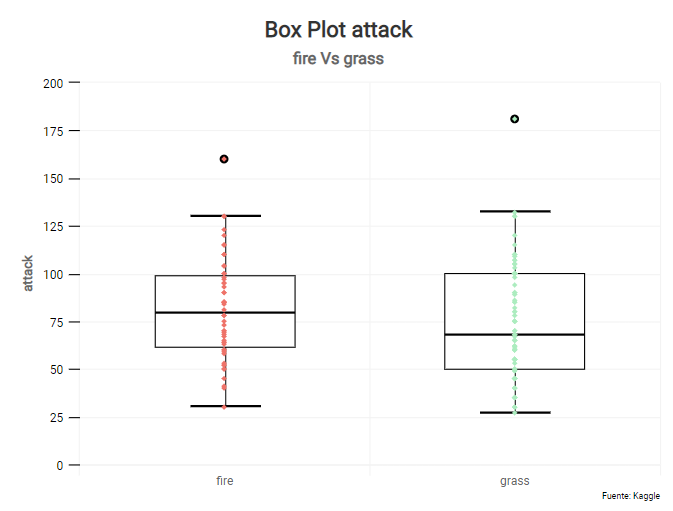
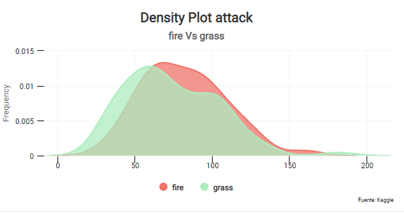

<p align="center">

</p>

# Pokemon Shiny App


<p>
<a href="https://pkgs.rstudio.com/flexdashboard/" rel="nofollow"></a>
<a href="https://shiny.rstudio.com/" rel="nofollow"></a>
</p>


### Contenido:
<br>
</br>

- [**Introduccion**](https://github.com/MGaloto/Pokemon_App#introduccion)
- [**Motivacion**](https://github.com/MGaloto/Pokemon_App#motivacion)
- [**Estructura del Repositorio**](https://github.com/MGaloto/Pokemon_App#estructura)
- [**Flexdash**](https://github.com/MGaloto/Pokemon_App#flexdash)
- [**Graficos**](https://github.com/MGaloto/Pokemon_App#graficos)
- [**Conclusion**](https://github.com/MGaloto/Pokemon_App#conclusion)

## Introduccion


<div style="text-align: right" class="toc-box">
 <a href="#top">Volver al Inicio</a>
</div>

<br>
</br>

Proyecto sobre un aplicacion [flexdashboard](https://pkgs.rstudio.com/flexdashboard/) utilizando datos de todos los Pokemons. 

Se busca analizar las cualidades de cada uno de ellos como tambien la diferencia entre los tipos de pokemon. (Rock, Fire, Grass..) mediante visualizaciones hechas en {highcharter}, usando la estructura de {flexdashboard} y la dinamica de {shiny}.

Por ultimo, se va a utilizar [Docker](https://www.docker.com/) para crear una imagen en base a una existente sumandole las dependencias que necesita este proyecto.

<p align="center">
  
</p>


### Incluye

- Graficos Dinamicos y Estaticos. ✅ 
- Interactividad con Shiny. ✅ 
- Estadistica Descriptiva. ✅ 

## Motivacion


<div style="text-align: right" class="toc-box">
 <a href="#top">Volver al Inicio</a>
</div>

<br>
</br>

Todo comenzo cuando me encontre con el Data Set de [Pokemon](https://www.kaggle.com/datasets/rounakbanik/pokemon) y pense en desarrollar un dashboard en {flexdashboard} usando la estetica de los graficos que provee {highcharter}. 

Me encontre con que queria relacionar los distintos tipos de Pokemons y ver sus cualidades, para ello le agregue graficos dinamicos en donde se pueden seleccionar distintos tipos de Pokemons y sus habilidades para poder ver similitudes y diferencias entre ellos.

El Dashboard permite tener una idea general sobre los distintos tipos de Pokemons que existen y comparar entre ellos sus fortalezas y debilidades por tipo. 

Respecto a las tecnologias utilizadas tambien nos permite ver el potencial de las librerias para implementarlas en distintos proyectos de Ciencia de Datos.


## Estructura


<div style="text-align: right" class="toc-box">
 <a href="#top">Volver al Inicio</a>
</div>

<br>
</br>


``` shell
.
├── docker-compose.yml
├── .github
├── data
├── docker
├── docs
├── index.Rmd
└── images
```


- `docker-compose.yml` se utiliza para setear volumes, imagen y puertos para ejecutar el trabajo.
- `index.Rmd` contiene el trabajo principal.
- `.github` contiene el WorkFlow.
- `docker` contiene todos los archivos de configuración de imágenes de Docker (por ejemplo, Dockerfiley algunos archivos auxiliares)
- `docs` se usa para almacenar los archivos del tablero renderizados.
- Todas las imágenes del archivo README se almacenarán en `images`.


## Flexdash


<div style="text-align: right" class="toc-box">
 <a href="#top">Volver al Inicio</a>
</div>

<br>
</br>

El dashboard incluye la flexibilidad y estructura de un Flexdashboard con la interactividad de Shiny.

El uso de Shiny con flexdashboard convierte un informe R Markdown estático en un documento interactivo. 

Al agregar Shiny a un flexdashboard, se pueden crear tableros que permitan cambiar los parámetros subyacentes y ver los resultados de inmediato o que se actualicen de forma incremental a medida que cambian los datos subyacentes. 


```r
---
title: 'Dashboard'
output: 
  flexdashboard::flex_dashboard:
    logo: www/logo.svg.png
    theme : spacelab
runtime: shiny_prerendered
---
```


## Graficos


<div style="text-align: right" class="toc-box">
 <a href="#top">Volver al Inicio</a>
</div>

<br>
</br>

Las siguientes imagenes son algunos de los graficos que se utilizaron para el dashboard:

### Scatter Plot

Los gráficos de dispersión también son conocidos como gráficos XY y su función principal es la de mostrar la relación que existe entre los valores numéricos de diferentes series de datos sobre los ejes de coordenadas XY.

El Dashboard permite cambiar el tipo de Pokemon como tambien cada uno de los ejes XY para elegir distintas habilidades y ver como se relacionan.


<br>



<br>


### Bubble Plot

El grafico de Burbujas permite observar los Pokemons (Solo los primeros 151 Pokemons) por tipo y tambien agruparlos por esta misma feature.


<br>



<br>


### Bar Plot

Los graficos de barra que esta en el dashboard son dos:

* Uno permite cambiar la edicion de los Pokemons y ver la cantidad por tipo de Pokemon.
* Los otros barras en donde al seleccionar un tipo de Pokemon se pueden ver el top 5 por habilidad.


<br>



<br>


### Box Plot

El gráfico de caja es una forma de presentación estadística destinada, fundamentalmente, a resaltar aspectos de la distribución de las observaciones en una o más series de datos cuantitativos.

En este grafico podemos visualizar medidas de tendencia central y compararlas con 2 tipos de Pokemons.


<br>



<br>


### Density Plot

El gráfico de densidad muestra la distribución suavizada de los puntos a lo largo del eje numérico. Los picos del gráfico de densidad se encuentran en las ubicaciones donde existe la mayor concentración de puntos.


<br>



<br>


## Conclusion


<div style="text-align: right" class="toc-box">
 <a href="#top">Volver al Inicio</a>
</div>

<br>
</br>

El tablero tiene distintas métricas y gráficos para poder ver y analizar la diferencia entre distintos tipos de pokemons. 
En esta primera versión se buscó principalmente un tablero con estética y diferentes funcionalidades para interactuar y sacar conclusiones sobre las visualizaciones. 

Las próximas actualizaciones serán:

- Un mejor servidor para tener una mejor experiencia de usuario.
- Nueva sección para comparar habilidades entre dos pokemons.
- Nuevas funcionalidades del universo de Shiny.
